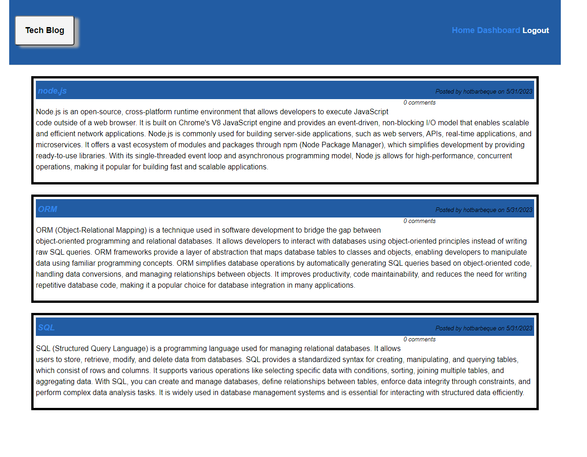

# C14-Tech-Blog-KC

## Description

Full Stack web application for tech blog posts. The app allows a user to sign-up, login, add and view comments in a blog setting.

## Table of Contents

- [Installation](#installation)
- [Usage](#usage)
- [License](#license)
- [Questions](#questions)

## Installation

 To install the app, clone the repo then in the terminal put in. 
 `npm i , mysql -u root -p , source schema.sql, npm start` 

## Usage

[Heroku](https://c14-tech-blog-kc.herokuapp.com/)

## License

MIT

## Questions

GitHub: HotBarbeque

Email: kyry.curry@gmail.com
